# Mi primer proyecto con Keycloak
Proyecto didáctico de iniciación al gestor de identidades Keycloak realizado por Joaquin Castro.

# Índice de contenidos:
- [1. Introducción](#seccion-1)
- [2. Terminología y conceptos básicos](#seccion-2)
- [3. Enlaces de interés](#seccion-3)
- [4. Primeros pasos con Keycloak](#seccion-4)
  - [4.1. Instalación del servidor en el sistema](#apartado-4-1)
  - [4.2. Configuración inicial del servidor Keycloak]({#apartado-4-2})
  - [4.3. Creación del reino de pruebas](#apartado-4-3)
  - [4.4. Creación de la aplicación cliente/servidor de recursos](#apartado-4-4)
  - [4.5. Creación de otras entidades Keycloak](#apartado-4-5)
    - [4.5.1. Creación de usuarios](#punto-4-5-1)
    - [4.5.2. Creación de grupos de usuarios](#punto-4-5-2)
    - [4.5.3. Creación de roles](#punto-4-5-3)
- [5. Gestión de autenticación/autorización de identidades mediante llamadas HTTP a la API REST de Keycloak](#seccion-5)
- [6. Creación de un proyecto Spring Boot para la gestión de endpoints personalizados de interacción con el servidor Keycloak](#seccion-6)
- [7. Extensión de funcionalidades personalizadas en Keycloak](#seccion-7)
  - [7.1. ¿Qué es un SPI?](#apartado-7-1)
  - [7.2. Procedimiento de inserción de proveedores personalizados en nuestro servidor Keycloak](#apartado-7-2)
  - [7.3. Configuración de proveedores mediante la consola de comandos](#apartado-7-3)
    - [7.3.1. Establecer una configuración por defecto de un proveedor](#punto-7-3-1)
    - [7.3.2. Habilitar/deshabilitar un proveedor del servidor Keycloak](#punto-7-3-2)
  - [7.4. Eventos de proveedores](#apartado-7-4)
  - [7.5. Cómo crear tu propio SPI](#apartado-7-5)
- [8. Proceso de autenticación de un usuario en el servidor Keycloak](#seccion-8)
- [9. Personalización de interfaces gráficas para la mejora de UX en Keycloak](#seccion-9)
  - [9.1. Temas por defecto](#apartado-9-1) 
  - [9.2. Tipos de temas en Keycloak](#apartado-9-2)
  - [9.3. Estructura interna de los temas](#apartado-9-3)
  - [9.4. Personalizando nuestras interfaces de usuario](#apartado-9-4)
    - [9.4.1. Personalizando el logo de la sección superior de Keycloak](#punto-9-4-1)
    - [9.4.2. Personalizando la pantalla de inicio de sesión de Keycloak](#punto-9-4-2)
    - [9.4.3. Personalizando la pantalla de bienvenida de Keycloak](#punto-9-4-3)

# 1. Introducción:
Keycloak es una plataforma de código abierto para soluciones de inicio de sesión único (*Single Sign-On, SSO*) que ofrece servicios de **autenticación**, **autorización** y **gestión de identidades** tanto para aplicaciones web como móviles. Actúa como un servidor de seguridad independiente a las aplicaciones que creemos a su alrededor, lo que nos permite a los desarrolladores la externalización de la gestión de usuarios y seguridad de nuestras aplicaciones. Keycloak está construído sobre **tecnologías de securización estándar robustas** como OpenID Connect, OAuth 2.0 y SAML, lo que garantiza la interoperabilidad y la integración con gran variedad de tecnologías debido a su alta **escalabilidad**.

Una de las características más destacadas de Keycloak es su **alto nivel de abstracción** y su **diversa gama de funcionalidades** que permiten entre sus características una poderosa simplificación y seguridad en el proceso de autenticación y autorización de usuarios, roles y grupos en nuestras aplicaciones. Además, Keycloak ofrece una **interfaz de administración sobre navegador web** intuitiva para facilitar la configuración y el monitoreo de la seguridad de las aplicaciones. También es posible usar Keycloak como plataforma de integración para conectar a servidores **LDAP** y/o **Active Directory** preexistentes; así como el **inicio de sesión social** (*social login*) con redes sociales como Google, GitHub, Facebook o Twitter, o la **autenticación en dos factores** (*two-factor authentication*) compatible con TOTP/HOTP vía Google Authenticator o FreeOTP. Estos puntos y muchos más que veremos a lo largo del repositorio convierten a Keycloak en una solución completa y poderosa para las necesidades de securización de aplicaciones modernas, en el que la combinación de seguridad robusta y escalable, facilidad en su empleo y su amplia gama de funcionalidades lo convierten en una opción atractiva y asequible para administradores y organizaciones que deseen garantizar la seguridad y privacidad de las aplicaciones que desarrollen.

# 2. Terminología y conceptos básicos:
Debido a la elevada y completa tecnología que Keycloak emplea en sus procesos de securización, existen ciertos términos técnicos de seguridad para esta plataforma que es preciso conocer antes de ponernos en materia:

- **Autenticación**: Es el proceso de identificar y validar a un usuario en nuestra plataforma.
- **Autorización**: Es el proceso de permitir el acceso a un usuario para la consumición de un recurso.
- **Reino**: En Keycloak, un reino o dominio (en inglés *realm*) es un espacio de aislamiento lógico que representa a una partición independiente de la funcionalidad de autenticación/autorización. Dentro de un reino es donde se definen a usuarios, clientes, roles y políticas de seguridad. Cada reino posee su propia base de datos de usuarios y configuraciones de seguridad. Esta arquitectura permite a las organizaciones administrar múltiples dominios de seguridad de forma separada y segura. Los reinos también pueden tener sus propias configuraciones personalizadas para temas, flujos de autenticación y políticas de seguridad, así como completo control sobre el proceso de autenticación/autorización.
- **Cliente**: Un cliente en Keycloak (en inglés *client*) es una entidad externa que representa a una aplicación o servicio que interactúa con el servidor de autenticación de Keycloak para poder autenticar el acceso de los usuarios y permitirles acceder a los recursos y servicios protegidos. Los clientes pueden ser aplicaciones web, aplicaciones móviles, servicios RESTful o cualquier otro tipo de aplicación. Cada cliente posee su propio conjunto de credenciales de seguridad y configuración que le permite comunicarse de forma segura con el servidor Keycloak.
- **Usuario**: Los usuarios (en inglés *users*) son entidades que representan a personas o entidades que pueden iniciar sesión dentro de tu sistema y así obtener acceso a los recursos protegidos mediante credenciales específicas. Pueden poseer atributos asociados con ellos mismos de información adicional como el nombre de usuario, el correo electrónico, un número de teléfono o su fecha de nacimiento, los cuales pueden ser empleadas por las aplicaciones y servicios para personalizar su experiencia de usuario y aplicar políticas de autorización específicas. Se les puede asignar su pertenencia a uno o varios grupos de usuarios, así como asignarles diferentes tipos de roles.
- **Grupo de usuarios**: Los grupos de usuarios (en inglés *user groups*) son entidades que permiten a nosotros como administradores la organización y gestión de usuarios Keycloak de una forma lógica y eficiente. Un grupo de usuarios puede contener a uno o más usuarios relacionados entre sí mediante algún criterio común. Estos facilitan la aplicación de políticas de acceso y asignación de recursos, así como la delegación de tareas administrativas al poder asignar roles de gestión por grupos.
- **Rol**: Un rol (en inglés *role*) es una entidad que define a un conjunto de permisos y privilegios asociados a un usuario dentro de una aplicación o servicio protegido por el servidor Keycloak. Los roles representan los diferentes niveles de autorización que pueden ser asignados a los usuarios para que éstos puedan acceder a recursos específicos o realizar acciones dentro de nuestra aplicación. Pueden ser asignados a usuarios de manera individual o a través de grupos de usuarios, flexibilizando y generando un análisis de grano fino de los permisos de acceso. Los roles pueden realizarse **a nivel de cliente**, es decir, asociado a un cliente en particular, los cuales son útiles cando es necesario definir permisos que se encuentran especificados dentro de un cliente en particular dentro de nuestro proveedor de identidades, o **a nivel de reino**, los cuales se encuentran globalmente dentro de un reino/dominio Keycloak y por lo tanto pueden ser asignados dentro de múltiples clientes, por lo que el alcance de estos es mucho más amplio.
- **Recurso**: Un recurso (en inglés *resource*) es cualquier elemento o funcionalidad dentro de una aplicación o servicio protegido por nuestro servidor Keycloak. Estos pueden incluir páginas web, servicios API RESTful, archivos, funciones específicas de la aplicación, o cualquier otro activo que necesite ser protegido y securizado en temas de autenticación/autorización. EStos recursos se definen y configuran para establecer políticas de seguridad mediante el uso de roles y permisos específicos que regulan el acceso a estos y las acciones que tienen permitido realizar una vez ya accedido. La gestión de recursos en Keycloak permite a los administradores definir y mantener una estructura organizada para la protección adecuada de datos sensibles.
- **Alcance**: En Keycloak, un alcance (en inglés *scope*) se refiere a un conjunto de permisos y recursos específicos a los que un cliente tiene acceso después de haber sido autenticado correctamente dentro del servidor Keycloak. Los alcances se usan para definir el nivel de autorización que se otorga a un cliente para acceder a recursos protegidos. Estos alcances pueden ser estándar (definidos por los protocolos de autenticación como OpenID Connect o OAuth 2.0) o estar personalizados por los administradores para adaptarse a requisitos específicos, dependiendo de las necesidades de la aplicación. Sirven para implementar una política de autorización de grano fino, asegurando que los clientes únicamente tengan acceso a los recursos necesarios para realizar las funciones para las que ha sido planeado.
- **Proveedor**: Un proveedor (en inglés *provider*) es un módulo que extiende la funcionalidad del servidor de identidad y autenticación. Los proveedores se pueden agregar a un reino de Keycloak para personalizar su comportamiento y adaptarlo a las necesidades específicas de una organización o aplicación. Por ejemplo, un proveedor de autenticación puede implementar un flujo de autenticación personalizado, mientras que un proveedor de temas puede cambiar la apariencia del servidor de Keycloak. Los proveedores se implementan mediante la interfaz de programación de servicios (SPI) de Keycloak, que define un conjunto de métodos que deben ser implementados por los proveedores para proporcionar una funcionalidad específica.
- **Reclamación**: En Keycloak, una reclamación o solicitud (en inglés *claim*) es un atributo de información sobre un usuario que se incluye en un token de seguridad emitido por el servidor durante el proceso de autenticación. Estas solicitudes proporcionan detalles sobre la identidad del usuario, y son parte del estándar JWT para representar y transmitir la información de autenticación de forma segura entre aplicaciones y/o servicios. Éstos pueden ser estándar, como los definidos por OpenID Connect, o personalizados, definidos por los administradores de Keycloak para incluir información adiciona relevante para la aplicación.
- **Sesión**: Una sesión (en inglés *session*) es el período de tiempo durante el cual un usuario se encuentra autenticado y tiene acceso a los recursos protegidos dentro de una aplicación o servicio. Cuando un usuario inicia sesión en la plataforma, se crea una sesión para gestionar dicho inicio de sesión en la que contendrá toda la información de acceso del usuario y de en qué aplicaciones ha participado. Tanto administradores como usuarios pueden ver información de sesión. La gestión de sesiones en Keycloak es fundamental para garantizar la seguridad e integridad de las aplicaciones protegidas, empleando tokens de acceso para controlar y mantener las sesiones de usuario.
- **Credenciales**: Las credenciales (en inglés *credentials*) son fragmentos de datos que Keycloak utiliza para verificar la identidad de un usuario. Las credenciales más conocidas son las contraseñas (*passwords*), las de un solo uso (*one-time passwords, OTP*), los certificados digitales, e incluso las huellas dactilares.
- **Token de acceso**: El token de acceso (en inglés *access token*) es un token que puede ser proporcionado como parte de una solicitud HTTP el cual permite el acceso al usuario del servicio el cual está siendo invocado. Como especificación técnica, forma parte de los estándares de securización de OpenID Connect y de OAuth 2.0.
- **Flujo de autenticación**: Un flujo de autenticación (en inglés *authentication flow*) es un flujo de trabajo que un usuario debe realizar cuando interaccione con ciertos aspectos del sistema. Por ejemplo, un flujo de inicio de sesión puede definir qué tipo de credenciales son requeridos para acceder a la aplicación; mientras que un flujo de registro define qué tipo de información debe introducir un usuario y si algún método de tipo CAPTCHA debe ser empleado para filtrar el uso de bots por terceros; o el flujo de reseteo de credenciales define qué acciones debe realizar un usuario para que pueda modificar su contraseña.
- **Temas**: Los temas (en inglés *themes*) son plantillas HTML y hojas de estilo que respaldan las interfaces de usuario proporcionadas por Keycloak. Son fácilmente personalizables y anulables.

# 3. Enlaces de interés:
- [Página web oficial de Keycloak](https://www.keycloak.org/)
- [Repositorio GitHub oficial de Keycloak](https://github.com/keycloak/keycloak)
- [Ubicación raíz de la documentación oficial de Keycloak](https://www.keycloak.org/documentation)
- [Javadocs de los artefactos Keycloak](https://javadoc.io/doc/org.keycloak)
- [Guía Baeldung para la integración de Keycloak con Spring Boot](https://www.baeldung.com/spring-boot-keycloak)
- [Securización de servicios y aplicaciones con Keycloak](https://www.keycloak.org/docs/latest/securing_apps/index.html)
- [Guía oficial de administración de servidores Keycloak](https://www.keycloak.org/docs/latest/server_admin/index.html)
- [Guía oficial de desarrollo de servidores Keycloak](https://www.keycloak.org/docs/latest/server_development/index.html)
- [Guía oficial de servicios de autorización en Keycloak](https://www.keycloak.org/docs/latest/authorization_services/index.html)
- [Lista de referencias API REST para la administración de Keycloak](https://www.keycloak.org/docs-api/23.0.6/rest-api/index.html)
- [Colección Postman con la lista completa de llamadas a la API REST de Keycloak](https://documenter.getpostman.com/view/7294517/SzmfZHnd)

# 4. Primeros pasos con Keycloak:

## 4.1. Instalación del servidor en el sistema:
Para comenzar a trabajar con la plataforma Keycloak, será necesaria su instalación y puesta a punto en nuestro computador. Para ello, nos dirigiremos a la [página de descargas oficial de Keycloak](https://keycloak.org/downloads) y nos descargaremos el archivo ZIP del servidor cuya distribución se encuentra sostenida por Quarkus. Una vez descargado, descomprimiremos el archivo en el directorio cuya ruta deseemos guardar el programa dentro de nuestro sistema. Una vez ya correctamente descomprimido, encontraremos la siguiente estructura de subdirectorios:

- */bin:* Este directorio contiene varios scripts de inicio y parada del servidor Keycloak, o para realizar cualquier otra acción de gestión. Los scripts más importantes son **kc.sh** y **kc.bat**, que se utilizan para iniciar y detener el servidor en entornos Linux y Windows respectivamente. Estos scripts se encargan de configurar el entorno, cargar las bibliotecas necesarias y arrancar el servidor.
- */conf:* Directorio que contiene los archivos de configuración del servidor Keycloak. El archivo más importante es **standalone.xml**, que se utiliza para configurar el comportamiento del servidor. Este archivo contiene la configuración de los conectores del servidor, las bases de datos y las configuraciones de seguridad. También es posible configurar el servidor mediante una interfaz de línea de comandos, pero el archivo standalone.xml ofrece una forma más detallada y flexible de configurar el servidor.
- */data:* Este directorio se utiliza para almacenar los datos persistentes del servidor. Esto incluye la base de datos del servidor, que almacena información sobre los reinos, los usuarios y los roles. También contiene los archivos de registro, que se pueden utilizar para diagnosticar problemas con el servidor.
- */lib:* Directorio que contiene las librerías necesarias para que el servidor Keycloak funcione. Estas librerías incluyen el entorno de ejecución de Java, así como cualquier librería de terceros en las que depende el servidor. También contiene las propias dependencias Keycloak, que proporcionan la funcionalidad principal del servidor.
- */providers:* Directorio que contiene a los proveedores responsables de gestionar los flujos de autenticación y autorización del servidor, tanto proveedores integrados como proveedores de terceros que se pueden instalar para ampliar la funcionalidad del servidor en formato JAR. Puedes encontrar información sobre el uso de proveedores en la [guía oficial de Keycloak para el desarrollo de servidores](https://www.keycloak.org/docs/latest/server_development/index.html#_providers).
- */themes:* Este directorio contiene los temas de la interfaz de usuario del servidor Keycloak. Estos temas se utilizan para personalizar la interfaz de usuario del servidor y se pueden modificar para cambiar el aspecto del servidor. Contiene tanto temas integrados como temas de terceros que se pueden instalar para personalizar la interfaz de usuario del servidor. Puedes encontrar más información sobre el uso de temas en la [guía oficial de Keycloak para el desarrollo de servidores](https://www.keycloak.org/docs/latest/server_development/index.html#_themes).

Si deseamos comenzar a practicar con nuestro servidor Keycloak recién descomprimido, en primer lugar deberemos encender el servidor. Para ello, deberemos abrir un nuevo terminal desde este mismo directorio para insertar el siguiente comando en Linux:

`bin/kc.sh start-dev`

O, si tu sistema operativo es Windows:

`bin\kc.bat start-dev`

La primera vez en levantar los servicios tardará un tiempo algo extenso, ya que tiene que leer los archivos descomprimidos e instalar los plugins necesarios para su puesta en escena. Tras unos instantes, la terminal emitirá el siguiente mensaje:
`Running the server in development mode. DO NOT use this configuration in production.`
Lo cual nos informará que el servidor se encuentra listo para interactuar con él. En caso de querer apagarlo, simplemente deberemos usar el atajo de teclado CTRL + C en la consola de comandos para que el sistema nos pregunte si deseamos salir de Keycloak. Tras ello, deberemos responder 'Y' para regresar a la terminal inicial.

Si no puedes acceder al servidor desde el localhost o quieres arrancar Keycloak directamente desde la consola de comandos, puedes usar las variables de entorno *KEYCLOAK_ADMIN* y *KEYCLOAK_ADMIN_PASSWORD* para crear una cuenta de administración de la siguiente manera:

    export KEYCLOAK_ADMIN=<username>
    export KEYCLOAK_ADMIN_PASSWORD=<password>
    bin/kc.[sh|bat] start

## 4.2. Configuración inicial del servidor Keycloak:
Una vez el servidor se encuentre levantado, podremos acceder a su interior insertando en el navegador web de nuestro gusto la dirección de nuestro localhost y el puerto en el que el proveedor de identidad se encuentra escuchando. De forma predefinida, este puerto es el 8080, pero como va a entrar en conflicto con las futuras aplicaciones Spring que crearemos en torno a nuestros proyectos, cambiaremos el puerto de escucha al 8081. Para ello, con el servidor apagado, será necesario acceder al subdirectorio */conf* recién descomprimido y abrir el archivo *keycloak.conf* con el editor de texto de nuestra preferencia. Es en este archivo donde se almacenan todas las configuraciones de seguridad de esta aplicación. Una vez dentro, escribimos al final del mismo la propiedad `http-port=8081` para nuestro caso específico. Podremos poner cualquier puerto que deseemos, siempre y cuando no entre en conflicto con cualquier otro que ya se encuentre en uso. Guardamos el archivo y levantamos el servidor de la forma que ha sido explicada en el anterior punto. Una vez levantado, accedemos a nuestro navegador web e introducimos la URL `localhost:8081`. Nos aparecerá la pantalla de bienvenida de Keycloak, en el cual para acceder a la Consola de Administración nos pedirá la creación de un usuario administrador mediante usuario y contraseña. 

**Es muy importante recordar estas credenciales, ya que este usuario administrador tendrá todos los accesos necesarios tanto para acceder como para manipular nuestro servidor.** Una vez confirmados estos datos, presionamos el botón azul llamado *'Create'* y entramos en la consola. Nos aparecerá un formulario que volverá a pedir nuestras credenciales de administrador recién creadas para autenticarnos.  

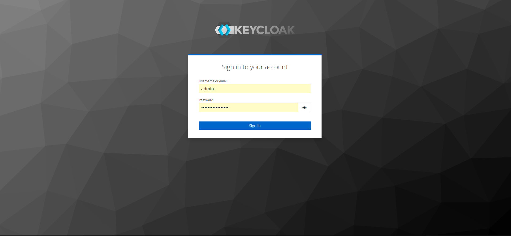

Por último, una vez nos encontramos autenticados correctamente como usuario administrador en el sistema, nos aparecerá la interfaz de Administración de Keycloak donde tendremos los mandos para construir los reinos, clientes, usuarios y roles necesarios para la correcta implementación de la autorización/autenticación de seguridad en nuestras aplicaciones.

Podemos ver los clientes que se crean de forma predeterminada junto con un reino si accedemos a la pestaña *'Clients'* del menú lateral situado en el extremo izquierdo de la consola de administración.

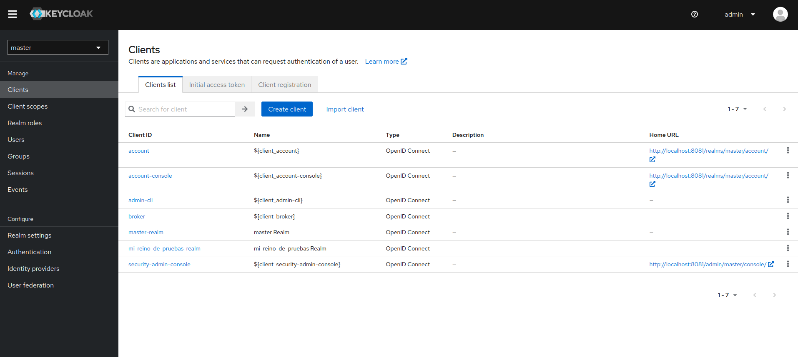

- **Account**: Es el cliente encargado de gestionar las cuentas de usuario del reino/dominio. A través de este cliente, los usuarios pueden realizar acciones como cambiar su contraseña, ver sus datos de perfil o desbloquear su cuenta.
- **Account Console**: Es una interfaz de usuario que permite a los usuarios administrar sus cuentas a través de la consola de Keycloak. Es similar a lo que ofrece el cliente **Account**, pero está diseñado específicamente para su uso en la consola de Keycloak.
- **Admin CLI**: Es un cliente que permite a los desarrolladores administrar el servidor Keycloak a través de la consola de línea de comandos (CLI). Esto es útil para automatizar tareas de administración y su uso está restringido a los usuarios que tengan permisos de administración.
- **Broker**: Es el encargado de gestionar los clientes externos que se conecten al servidor Keycloak. Este cliente es esencial para habilitar la federación de identidades, lo que permite a los usuarios iniciar sesión en Keycloak usando las credenciales de otros sistemas de autenticación. 
- **Security Admin Console**: Es el cliente encargado de gestionar los parámetros de seguridad de Keycloak. Ésto incluye la configuración de SSL, el control de acceso y la autenticación, y la configuración de la seguridad a nivel de sistema.

Antes que nada, podemos personalizar el formulario de inicio de sesión que tiene nuestro servidor Keycloak para que introduzca las opciones de 'He olvidado la contraseña' y 'Recuérdame', para que la experiencia con el usuario sea más inmersiva. Para ello, una vez dentro de nuestra consola de administración, navegaremos hacia el menú situado en la sección izquierda de la interfaz, y seleccionaremos la opción *'Realm Settings'*. Una vez dentro, navegaremos hacia la pestaña *'Login'* y dejaremos seleccionados los botones deslizantes *'Forgot password'* y *'Remember me'* hacia el lado **On**.

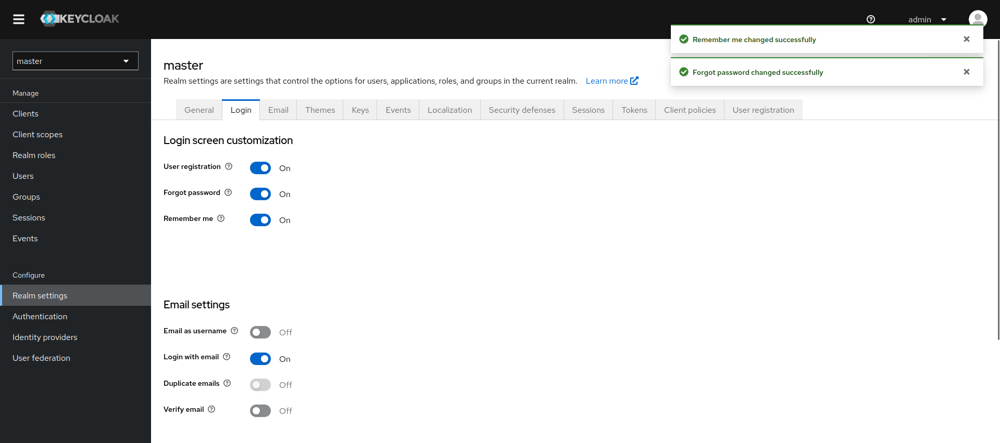

Para observar los cambios realizados, deberemos cerrar la sesión seleccionando la opción *'Logout'* del menú deslizable de la esquina superior derecha. Esto nos devolverá al formulario de inicio de sesión, donde aparecerán los nuevos componentes UI que acabamos de exponer:

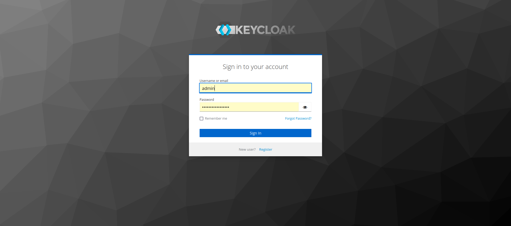

## 4.3. Creación del reino de pruebas:
Como podremos comprobar, al iniciarse por primera vez un servidor Keycloak viene de fábrica un reino predefinido denominado *master*. Este reino contiene a los usuarios, roles y configuraciones necesarios para administrar el propio servidor Keycloak, además de ser el único reino que tiene acceso a la interfaz de administración.  Los reinos se encuentran aislados entre sí y sólo pueden gestionar y autenticar a los usuarios bajo su control. Su uso exclusivo es la administración y configuración del servidor principal; es por ello que, para su uso correcto, **nunca debemos crear nuestras aplicaciones y servicios cliente directamente sobre este reino, sino crear uno en exclusiva para nuestra aplicación.** 

Para la creación de un nuevo reino de pruebas en nuestro servidor Keycloak, deberemos ir al menú desplegable existente en la esquina superior izquierda de la interfaz de Administración y presionar el botón azul llamado *'Create realm'*.

Insertamos los datos que deseemos que nuestro nuevo reino posea en su configuración, y acto seguido presionamos el botón *'Create'* para que el sistema nos genere el entorno necesario en el que trabajaremos y nos expandiremos en los próximos puntos de este documento.

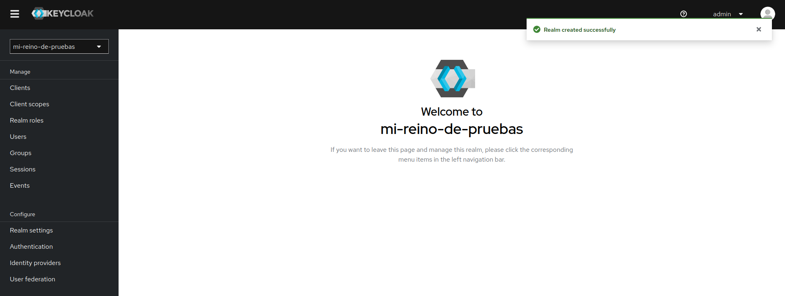

## 4.4. Creación de la aplicación cliente/servidor de recursos:
Una vez tenemos ya la partición lógica en nuestro servidor Keycloak lista para meternos en materia, vamos a proceder a la creación de un nuevo cliente que haga la función de servidor de recursos. De acuerdo con la especificación OAuth 2.0, un servidor de recursos es un servidor el cual aloja los recursos protegidos de nuestra apliación y que es capaz de aceptar y responder peticiones hacia estos recursos. Cualquier aplicación cliente puede ser configurada para soportar permisos de frano fino, convirtiéndolo conceptualmente en un servidor de recursos. Para ello, haremos click en la pestaña *'Clients'* del menú situado en el lado izquierdo de la interfaz de administración y, una vez en su interior, hacer click en el botón con fondo azul llamado *'Create client'*. Esto nos abrirá la ventana de interacción para introducir todos los datos nuevos que tendrá nuestro nuevo cliente. Rellenamos los campos de texto con dicha información y presionamos el botón *'Next'*.

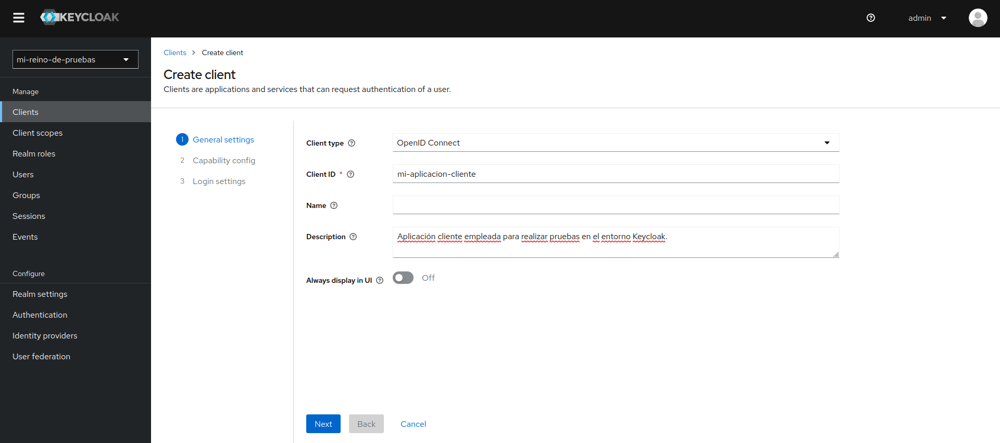

A continuación se nos desplegarán las opciones de configuración. Nos aseguramos que los botones deslizantes *'Client authentication'* y *'Authorization'* se encuentren ambos en el lado **On** y dejamos activada la casilla de selección *'Service accounts roles'*. Presionamos nuevamente el botón *'Next'*.

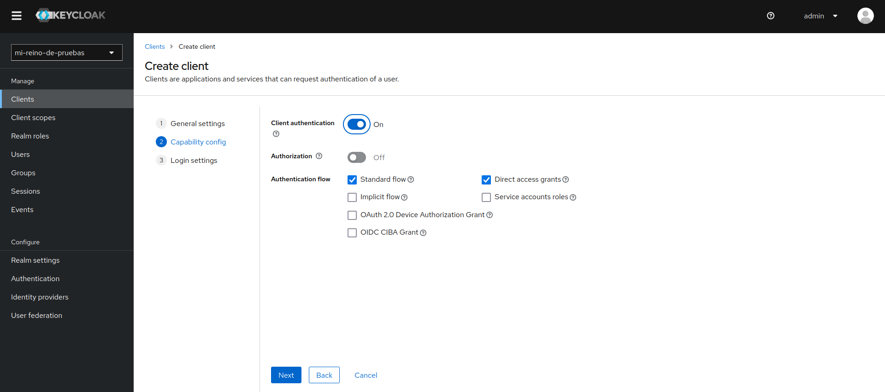

En la última ventana, presionamos el botón *'Save'*. Se nos abrirá una nueva interfaz con los datos del cliente recién creado en el sistema. Ahora, dentro de la pestaña *'Settings'*, saltaremos hacia la sección *'Access Settings'* e introduciremos el siguiente valor en el área de texto de **Root URL**:

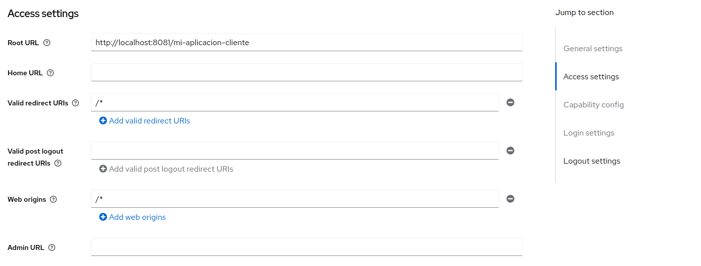

Por último, cambiaremos la vista hacia la pestaña *'Service accounts roles'* y, tras presionar el botón azul llamado *'Assign role'*, buscaremos en la lista de selección el rol del cliente *realm-management* llamado **realm-admin**, el cual nos permitirá poder emplear las llamadas HTTP mediante la API de Keycloak usando las credenciales de este cliente para su autenticación, como se verá en mayor profundidad durante la quinta sección del documento.

## 4.5. Creación de otras entidades Keycloak

### 4.5.1. Creación de usuarios:
Una vez diseñado correctamente tanto el rol de pruebas en el que desarrollaremos nuestra aplicación como el cliente encargado de realizar el trabajo de gestionar los recursos del reino, es la hora de introducir en el sistema a las diferentes entidades correspondientes. Como ya se comentó en el punto introductorio, uno de los puntos fuertes de Keycloak es su interfaz de usuario altamente amigable y personalizable, que permite a los administradores su completa libertad de movimiento sin apenas conocimientos previos sobre el tema. El menú lateral situado a la izquierda de la interfaz de Administración contiene pestañas dedicadas para la creación, modificación y eliminación de usuarios, grupos, alcances y roles, así como de botones vistosos que nos indican el flujo de gestión de estos elementos. Vamos, en primer lugar, a crear un usuario. Para ello, simplemente deberemos hacer click en la pestaña *'Users'* para que el sistema nos cargue en la vista la lista de usuarios del sistema, y únicamente tengamos que darle al botón azul llamado *'Add user'*.

Rellenamos todos los datos necesarios en los correspondientes paneles de texto y, cuando terminemos, presionamos el botón azul *'Create'*. Con este gesto tan sencillo, hemos introducido un usuario en el sistema. Repite el proceso cuantas veces te sea necesario para insertar los usuarios que necesites. También puedes acceder a cualquier usuario que hayas creado desde la lista para modificar sus datos en cualquier momento y asignarlo o desasignarlo de roles y/o grupos de usuarios desde aquí.

### 4.5.2. Creación de grupos de usuarios:
Crear un grupo de usuarios es igual de sencillo. Únicamente deberemos hacer click en la pestaña *'Groups'* situada en el menú en parte izquierda de la interfaz de Administración, y posteriormente presionar el botón azul *'Create group'*. Nos saltará una ventana de alerta pidiendo el nombre que tendrá el nuevo grupo y, tras decidirlo, presionar el botón *'Create'*. El nuevo grupo aparecerá en la lista, listo para que interacciones con él y puedas asignarle usuarios y roles de grupo.

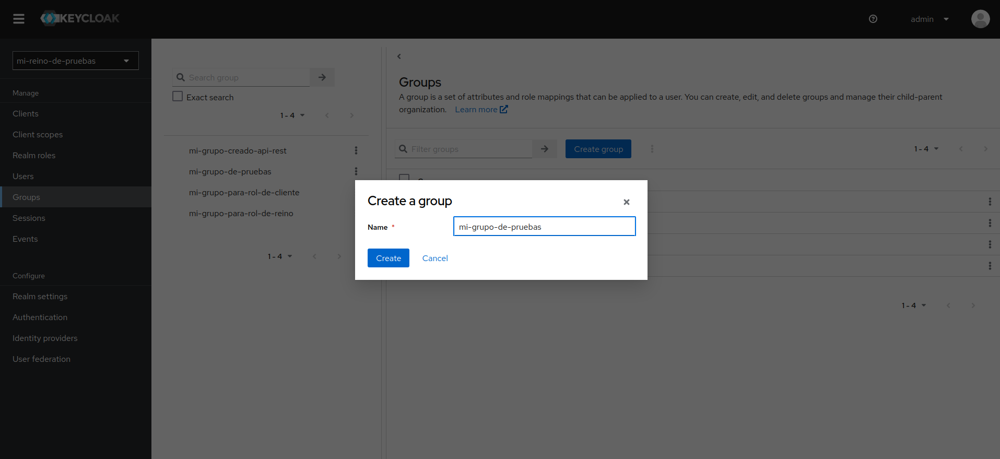

### 4.5.3. Creación de roles:
Hay dos tipos de roles, y por tanto dos formas diferentes de crearlos, uno por cada tipo. Para crear un rol *a nivel de reino*, únicamente será necesario presionar en la pestaña *'Realm roles'* del menú situado a la izquierda de la interfaz de Administración, y después presionar el botón azul *'Create role'*. Se nos abrirá una ventana nueva para que el administrador pueda insertar los datos del nuevo rol de reino a crear.

Una vez listo, dale al botón *'Save'*. El nuevo rol aparecerá en la lista, preparado para interactuar con él. Haciendo click en su nombre tendrás acceso a su interior, pudiendo escoger los usuarios que desees que tengan asignado dicho rol. Para crear un rol *a nivel de cliente*, será necesario acceder al interior del cliente en el cual desees crear dicho rol haciendo click en la pestaña *'Clients'* del menú situado en la parte izquierda de la interfaz de Administración. Una vez en su interior, deberemos dirigirnos a la subpestaña *'Roles*' y presionar el botón *'Create role'*. Nuevamente, se nos abrirá una interfaz para introducir la información de interés del nuevo rol de cliente.

# 5. Gestión de autenticación/autorización de identidades mediante llamadas HTTP a la API REST de Keycloak:
Como ya ha sido comentado en el punto introductorio, Keycloak es una solución para inicio de sesión único tanto para aplicaciones web y móvil como para servicios RESTful, que permite a los desarrolladores interactuar y gestionar de forma programática diversos aspectos de la plataforma. Este conjunto de llamadas API REST proporcionan una interfaz bien definida y documentada que permite realizar operaciones CRUD mediante solicitudes HTTP estándar mediante el uso de los métodos GET, POST, PUT y DELETE. Los datos se intercambian en formato JSON, la notación estándar del paradigma REST, la cual destaca en su flexibilidad y capacidad de integración con todo tipo de aplicaciones y plataformas. Los desarrolladores/administradores pueden emplear esta funcionalidad como recurso alternativo a la interfaz de Administración para interactuar con las entidades de tu servidor Keycloak, siendo igual de diversa y potente que esta. Podrás encontrar la documentación oficial del servicio de llamadas HTTP a la API REST de Keycloak en el [siguiente enlace](https://www.keycloak.org/docs-api/23.0.6/rest-api/index.html), y en este mismo repositorio se encuentra una colección de Postman en la que encontrarás todo tipo de llamadas guardadas y separadas por grupos.

Para poder interactuar con el cliente de Keycloak que hemos creado en el punto anterior, deberemos primero obtener un token de autenticación del servidor para la securización de nuestras aplicaciones, estando protegidas con el esquema de la **autenticación Bearer**. Una vez obtengamos ese token del servidor, podremos hacer llamadas al resto de endpoints disponibles en la colección. Para la ejecución de este punto recomiendo el uso del programa Postman, el cual es una herramienta muy popular utilizada para crear, probar y documentar APIs mediante llamadas HTTP. Estas llamadas se realizan mediante el uso de los estándares abiertos como **OpenID Connect**, el cual tiene un endpoint público para que los desarrolladores puedan interactuar con él. Simplemente, hay que realizar una llamada de tipo GET al endpoint `/realms/{{realm}}/.well-known/openid-configuration/`. Si el servidor se encuentra debidamente operativo, habrá una respuesta con código 200 y un JSON en su body con todo tipo de endpoints y características del estándar. El endpoint necesario para la obtención de nuestro token de acceso es aquel que se encuentra en el valor **"token_endpoint"** del JSON de salida. Cogeremos dicho endpoint y lo pondremos en otra llamada HTTP, esta vez de tipo POST. Como es con este token con el que nos autenticaremos con el cliente/servidor de recursos, deberemos poner los siguientes parámetros en el body de nuestra petición:

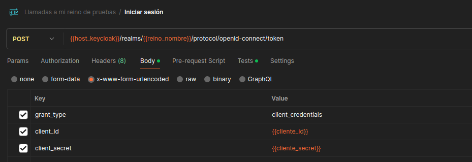

En el que **client_id** y **client_secret** son las credenciales del cliente/servidor de recursos que podremos obtener desde la subpestaña *'Credentials'* en la interfaz de Administración. Por último, le damos al botón *'Send'* para enviar la petición. Si todo ha salido correctamente, este nos devolverá una respuesta con código 200 y un JWT en el valor del atributo **access_token**. Este es el token que deberá ser empleado en el resto de llamadas a la API REST de Keycloak, usando la opción *'Bearer token'* del menú desplegable situado en la pestaña *Authorization* de la llamada HTTP en sí. También nos indicará el tiempo de expiración del token en segundos en el valor **expires_in**. JWT (del inglés *JSON Web Token*) es un estándar abierto basado en JSON que permiten la propagación de identidad de un usuario. Este token está firmado por la clave del servidor, por lo que el cliente y el servidor son ambos capaces de verificar que el token es legítimo. Estos JWT están formados por tres partes: un encabezado o *header* que indica el algoritmo usado en la firma, un contenido o *payload* donde se encuentra toda la información de los privilegios del token, y una firma o *signature* que está calculada codificando las dos anteriores partes en Base64. Estas tres partes se encuentran concatenadas usando puntos como separadores. Puedes decodificar un JWT en [este enlace](https://jwt.io/).

# 6. Creación de un proyecto Spring Boot para la gestión de endpoints personalizados de interacción con el servidor Keycloak:
Keycloak es un servidor de autenticación pensado para funcionar como proveedor de recursos para proyectos más grandes, delegando la gestión de la seguridad en este software. En nuestro caso, integraremos de forma completa nuestro reino de pruebas que ha sido creado y testeado en los anteriores puntos con un proyecto diseñado en el framework de Java, Spring Boot, en el objetivo de crear una aplicación web a través de la cual se puedan realizar llamadas a nuestro servidor de recursos de forma intermediaria, pero que a su vez también pueda ser escalable y usarla como apoyo para proyectos más grandes en el que podamos introducir más funcionalidades según las necesidades de la organización mediante gestores de proyectos como puede ser Maven.

Para comenzar un proyecto en Spring, podemos utilizar la [herramienta web de inicialización Spring](https://start.spring.io/) y el [repositorio central de Maven](https://mvnrepository.com/). Para nuestro proyecto, será necesaria la inserción de las siguientes dependencias en el archivo pom.xml:
- **Spring Boot Web:** Dependencia diseñada para crear aplicaciones Spring MVC que funcionen mediante microservicios RESTful.
- **Spring Security**: Dependencia que proporciona sistemas de autenticación y autorización robustas y protección contra ataques comunes como CSRF y XSS.
- **Lombok:** Dependencia que reduce el boilerplate eliminando código repetitivo. También incluye la anotación @Slf4j para generar logs eficientes.
- **OAuth2 Resource Server:** Dependencia que facilita la creación de un servidor de recursos seguro para procesar tokens de acceso con el estándar OAuth 2.0.
- **Keycloak Admin REST Client:** Dependencia que simplifica la interacción de la API de administración de Keycloak para aplicaciones Java.
- **RESTEasy JAX RS Implementation:** Implementación JAX-RS (Java API for RESTful Web Services) que facilita la creación de servicios web RESTful en aplicaciones Java.

La arquitectura del proyecto obedece al arquetipo de aplicaciones web con llamadas HTTP mediante APIs RESTful, separada en los siguientes paquetes:
- **Controladores:** Es la capa de la aplicación encargada de la ejecución de los endpoints con los que el usuario ejecutará llamadas HTTP.
- **Servicios:** Es la capa de la aplicación encargada de gestionar la sección lógica subyacente a las llamadas de la capa anterior.
- **DTO:** Objetos de entrada y salida de datos que se encargan de ejercer de puente entre las entidades del sistema y el usuario.
- **Configuración:** Paquete con las clases de configuración de seguridad personalizada para las necesidades del proyecto.
- **Útiles:** Paquete con los métodos necesarios para la obtención de las entidades de Keycloak a la aplicación Spring.

Acompañado del presente proyecto, además del árbol completo de directorios que componen el conjunto de microservicios web, viene adjunta otra colección Postman de llamadas a los controladores de la aplicación Spring creada en esta sección que realizan funciones análogas a las llamadas a la API REST del proveedor de identidades expuestas en el anterior punto del presente informe para la gestión de la securización del servidor Keycloak, pero empleando nuestra app web como intermediaria.

# 7. Extensión de funcionalidades personalizadas en Keycloak:

## 7.1. ¿Qué es un SPI?
El software de Keycloak ha sido desarrollado teniendo en cuenta los principios SOLID de buenas prácticas en el desarrollo de aplicaciones. El segundo principio de esta lista, el principio Open-Closed, estipula que la correcta funcionalidad de cualquier aplicación software **debe estar abierta para su extensión, pero cerrada para su modificación**. En otras palabras, Keycloak permite a los desarrolladores la creación de nuevas funcionalidades para su servidor, puede ser realizado sin tocar sus funciones core. Este hecho es conseguido gracias al uso de la clase [ServiceLoader](https://docs.oracle.com/en/java/javase/21/docs/api/java.base/java/util/ServiceLoader.html), la cual viene incluída en la librería principal de Java, la cual nos permite cargar implementaciones (también conocidas como proveedores de servicios, service providers o, simplemente, providers o proveedores).

Un SPI (del inglés **Service Provider Interface**) es una interfaz de programación de servicios que permite a los desarrolladores crear y conectar módulos de software personalizados a una aplicación existente. En el contexto de Keycloak, un SPI es una forma de extender la funcionalidad del servidor de identidad y autenticación para satisfacer las necesidades específicas de una organización o aplicación. Las implementaciones Java de esta lógica viene formalizada por la interfaz [Spi](https://javadoc.io/doc/org.keycloak/keycloak-server-spi/latest/org/keycloak/provider/Spi.html). Keycloak proporciona una serie de SPIs predefinidos que se pueden utilizar para personalizar diferentes aspectos del servidor, como la autenticación, la autorización, la gestión de usuarios y la integración con otros sistemas. Un SPI puede estar compuesto por uno o varios proveedores, ya que un SPI es una interfaz de programación que define un conjunto de métodos que deben ser implementados por los proveedores para proporcionar una funcionalidad específica en el contexto de una aplicación. Por lo tanto, un SPI puede tener múltiples implementaciones (los proveedores) que proporcionen diferentes formas de implementar la funcionalidad definida por el SPI.

Un punto de importancia capital a la hora de desarrollar el software de un módulo externo es el uso del siguiente patrón abstracto en la creación de un nuevo proyecto Maven desde cero:

1. **Provider:** Una clase de Java que implemente la interfaz [Provider](https://javadoc.io/doc/org.keycloak/keycloak-server-spi/latest/org/keycloak/provider/Provider.html) o de cualquiera de sus clases heredadas.
2. **Factory:** Una clase de Java que implemente la interfaz [ProviderFactory](https://javadoc.io/doc/org.keycloak/keycloak-server-spi/latest/org/keycloak/provider/ProviderFactory.html) o de cualquiera de sus clases heredadas.
3. Un archivo localizado en el interior del subdirectorio `src/main/resources/META-INF/services` cuyo nombre debe ser igual que la ruta completa de la *factory* predefinida de Keycloak que el nuevo proveedor desea ejecutar (incluyendo el paquete), y en cuyo interior se encontrará la ruta completa del nuevo *factory* creado por nosotros en nuestro proyecto exclusivo para el proveedor (nuevamente, con paquete incluído).

Una vez realizado, el *loader* creará un iterador para recorrer y localizar a todos los proveedores del sistema. 

Otro detalle importante a tener en cuenta es que **es obligatorio no usar constructores** en los *providers*, ya que de lo contrario el loader no sabrá como realizar la inyección de dependencias. Para ofrecer una solución a este problema, las interfaces *factory* tienen el método **create()**, el cual sirve como sustituto a los constructores de Java. Cuando queremos desarrollar una nueva funcionalidad para nuestro servidor Keycloak, creamos una clase *provider* que estipula una serie de métodos abstractos, los extendemos con la lógica a ejecutar, y empleamos el *factory* para su instanciación mediante el uso del método **create()**. Normalmente, cada *factory* instancia a un único objeto de *provider* por vez, por lo que es común utilizar el patrón **singleton**.

Podremos encontrar la lista completa de proveedores que se encuentran en nuestro servidor Keycloak si, desde el reino *master*, presionamos el menú extensible con nuestro nombre de usuario situado en la esquina superior derecha de la interfaz de administración y, desde allí, presionamos la opción *'Realm Info'* y posteriormente hacemos click en la pestaña *'Provider Info'*. Una vez en este apartado, la interfaz mostrará la lista completa de SPIs integrados en el servidor y todos los proveedores que conforman cada uno de dichos SPIs mostrados por su Provider ID.

En la lista podremos encontrar a los siguientes SPIs, entre otros:

- **Authenticator**: Esta interfaz sirve para agregar pasos personalizados que después se podrán emplear en los flujos de autenticación de los reinos existentes dentro de nuestro servidor Keycloak, permitiendo de esta manera a los desarrolladores/administraciones la creación de flujos de autenticación completamente libres para sus aplicaciones que permiten el uso de casos específicos que consideren necesario a la hora de permitir el acceso a los usuarios en su plataforma. Su lógica se basa en la implementación del SPI [AuthenticatorSpi](https://www.keycloak.org/docs-api/24.0.1/javadocs/org/keycloak/authentication/AuthenticatorSpi.html), el cual resulta de la conjunción de la interfaz proveedor [Authenticator](https://www.keycloak.org/docs-api/24.0.1/javadocs/org/keycloak/authentication/Authenticator.html) y su factoría [AuthenticatorFactory](https://www.keycloak.org/docs-api/24.0.1/javadocs/org/keycloak/authentication/AuthenticatorFactory.html).

- **Event Listener**: Es un mecanismo que permite a los desarrolladores crear y registrar sus propios oyentes de eventos (en inglés *event listeners*) personalizados, los cuales se activan en respuesta a diversos eventos que ocurren en el sistema de gestión de identidades. Algunos ejemplos de eventos incluyen el inicio de sesión de un usuario, la creación de un nuevo reino, o la actualización de un recurso en el sistema. Los oyentes de eventos se registran previamente en el sistema, y cuando un evento específico ocurre, Keycloak itera sobre la lista de oyentes registrados y llama al método correspondiente en cada uno de ellos. Esto permite a los desarrolladores extender y personalizar el comportamiento de Keycloak sin tener que modificar directamente el código fuente del sistema. Su lógica se basa en la implementación del SPI [EventListenerSpi](https://www.keycloak.org/docs-api/24.0.1/javadocs/org/keycloak/events/EventListenerSpi.html), el cual resulta de la conjunción de la interfaz proveedor [EventListenerProvider](https://www.keycloak.org/docs-api/24.0.1/javadocs/org/keycloak/events/EventListenerProvider.html) y su factoría [EventListenerProviderFactory](https://www.keycloak.org/docs-api/24.0.1/javadocs/org/keycloak/events/EventListenerProviderFactory.html).

  Si deseamos habilitar un oyente de evento personalizado ya previamente creado desde un archivo JAR en nuestra carpeta de proveedores, deberemos dirigirnos hacia la pestaña *'Realm Settings'* situada en el extremo izquierdo de nuestra interfaz de Administración, dentro del reino que deseemos adjuntar. Una vez en el interior, deberemos navegar hacia la pestaña *'Events'*, y posteriormente a la subpestaña *'Event listeners'*. Una vez allí seleccionaremos nuestro nuevo proveedor en la lista de menú desplegable denominada *'Event listeners'* y, tras haberla introducido, presionamos el botón azul llamado *'Save'*.

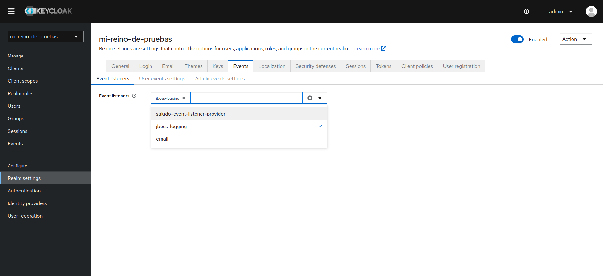

- **Password Policy:** Es una interfaz de programación de servicios que permite a los desarrolladores crear y conectar módulos de software personalizados a una aplicación existente para implementar políticas de contraseñas específicas que se ajusten a las necesidades específicas de una organización o aplicación. Su lógica se basa en la implementación del SPI [PasswordPolicySpi](https://www.keycloak.org/docs-api/21.0.0/javadocs/org/keycloak/policy/PasswordPolicySpi.html), el cual resulta de la conjunción de la interfaz proveedor [PasswordPolicyProvider](https://javadoc.io/doc/org.keycloak/keycloak-server-spi/latest/org/keycloak/policy/PasswordPolicyProvider.html) y su factoría [PasswordPolicyProviderFactory](https://www.keycloak.org/docs-api/22.0.5/javadocs/org/keycloak/policy/PasswordPolicyProviderFactory.html), que aplicarán las políticas de contraseñas específicas, como la validación de la complejidad de la contraseña, la verificación de la expiración de la contraseña y la aplicación de restricciones de bloqueo de cuentas.

    Para emplear su correcto uso en el servidor Keycloak, deberemos navegar hacia el menú situado al lado izquierdo de la consola de administración y seleccionar la opción *'Authentication'*, para posteriormente elegir la pestaña *'Policies'* y, después, la subpestaña *'Password Policy'*. Es en este punto de la consola de administración donde se gestionan todas las políticas relacionadas con los credenciales necesarios para la autenticación en el servidor. Observamos un cuadro de diálogo extensible con todas las políticas de credenciales, por lo que al pinchar en su interior para su despliegue se observará cómo nuestro nuevo proveedor se encuentra listo para ser seleccionado.

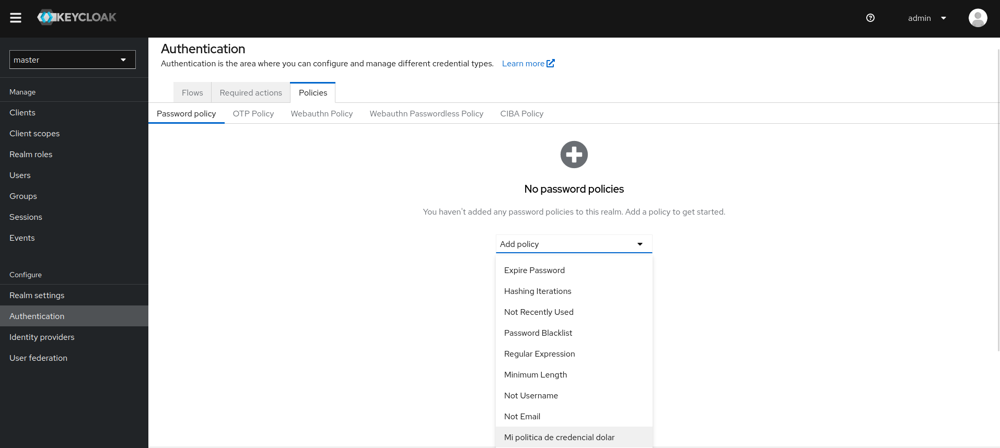

- **Required Action:** Las acciones requeridas (en inglés *required actions*) en Keycloak son funcionalidades que permiten a los administradores definir una serie de tareas que un usuario debe completar antes de poder realizar ciertas acciones; tales como iniciar sesión por primera vez, que el usuario acepte los términos y condiciones antes de poder iniciar sesión, o cambiar su contraseña. Además de estas acciones requeridas predefinidas, los desarrolladores pueden crear sus propios proveedores personalizados para adaptarse a las necesidades específicas de su aplicación. Su lógica se basa en la implementación del SPI [RequiredActionSpi](https://www.keycloak.org/docs-api/21.0.0/javadocs/org/keycloak/authentication/RequiredActionSpi.html), el cual resulta de la conjunción de la interfaz proveedor [RequiredActionProvider](https://www.keycloak.org/docs-api/21.0.0/javadocs/org/keycloak/authentication/RequiredActionProvider.html) y su factoría [RequiredActionFactory](https://www.keycloak.org/docs-api/21.0.0/javadocs/org/keycloak/authentication/RequiredActionFactory.html). La lógica detrás de las acciones requeridas implica la validación de las tareas completadas por el usuario y la actualización del estado de la cuenta de usuario en Keycloak. Cuando un usuario completa una acción requerida, el proveedor correspondiente actualiza el estado de la cuenta de usuario en Keycloak, lo que permite al usuario realizar dichas acciones permitidas.

  En caso de haber introducido en el servidor Keycloak un nuevo proveedor hijo de esta clase, para implementarlo debidamente en el sistema, deberemos navegar hacia la pestaña *'Authentication'* situada en el extremo izquierdo de la interfaz de Administración, y posteriormente navegar hacia la subpestaña *'Required Actions'*. Aquí aparecerá un listado completo de todas las acciones requeridas del servidor, y si navegamos hacia la parte inferior, observaremos que ahí se encuentra el proveedor recién implantado.

  Seleccionamos el botón deslizable *'Enabled'* hacia el lado **Off** y hacemos click en el botón azul llamado *'Save'*. Un alert nos confirmará que la acción ha sido habilitada. El siguiente paso es pinchar en la pestaña *'Users'* del menú situado a la izquierda de la consola de Administración, escoger el usuario en el que deseemos que se ejecute dicha acción requerida cuando inicie sesión en el sistema, y elegir nuestro proveedor en el menú desplegable denominado *'Required user actions'*, dentro de la subpestaña *'Details'*.

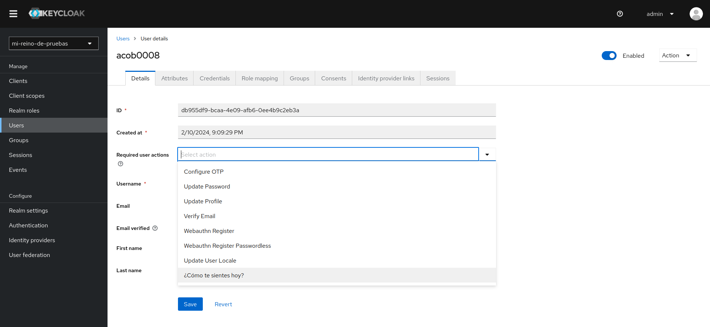

En el interior del presente repositorio se encuentran varios proveedores personalizados con los que se han ejecutado varias pruebas para la realización de este informe, tal y como se verá en mayor profundidad durante los siguientes puntos. Puedes encontrarlos en la sección de código para estudiar su comportamiento.

## 7.2. Procedimiento de inserción de proveedores personalizados en nuestro servidor Keycloak:
Una vez asegurados que cumple con todos los requisitos que han sido enumerados en el anterior punto para cumplir el patrón de diseño de los proveedores, ahora deberemos obtener el paquete JAR compilado con este nuevo módulo que contiene la nueva lógica personalizada. Para ello, es tan sencillo como utilizar Maven y llamar al comando de ciclo de vida 

`mvn:package`

Una vez finalizado con éxito el build de este JAR, deberemos guardarlo dentro del subdirectorio **/providers** que se había generado cuando descomprimimos por primera vez el servidor Keycloak en nuestro sistema, pegando el JAR en su interior. 

El siguiente paso es indicarle a Keycloak que existen nuevos proveedores personalizados que deseo que inicialice para que así aparezca en su lista de SPIs, lo cual se realiza desde la consola de comandos introduciendo la siguiente instrucción:

`bin/kc.[sh|bat] build`

**Debido a los últimos cambios en Quarkus, es necesario tener apagado el servicio del servidor Keycloak para que actualice sus proveedores de manera exitosa.** Tras ejecutarlo, la configuración de Keycloak empezará a trabajar. Tras unos instantes de carga, si todo ha salido como se desea, la propia consola nos indicará que ha encontrado dentro del directorio aquellos proveedores que hemos introducido en el directorio:

Ahora deberemos comprobar si lo que ha aparecido en la consola de comandos se traduce también en la consola de administración. Para ello, regresamos a la lista de proveedores de Keycloak y buscamos en el SPI 'password-policy' el proveedor que acabamos de crear con el ID que le hemos dejado especificado en su respectivo *factory*. Como se puede observar en la siguiente captura de pantalla, aparece de forma exitosa en el interior de dicha lista:

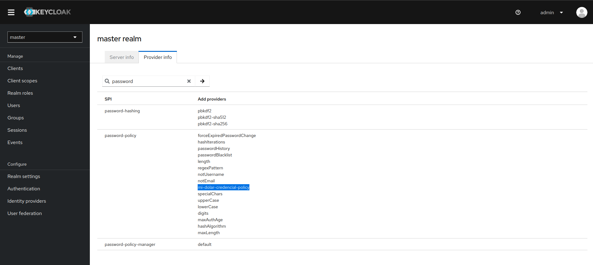

## 7.3. Configuración de proveedores mediante la consola de comandos:
Debido a la enorme capacidad de interacción que un servidor Keycloak para el correcto desarrollo de sus funciones, otra opción completamente válida para la configuración de los proveedores que manejamos es mediante el uso de comandos mediante la consola de nuestro sistema operativo. Podrás encontrar toda la información oficial respecto a estos casos de uso en la [guía de configuración de proveedores](https://www.keycloak.org/server/configuration-provider).

Este método, aunque totalmente factible, no es el único. Se pueden usar otros modos como inyectar los datos necesarios como variables del sistema. Esto es debido al patrón de modelo abstracto comentado en anteriores puntos, en el que el método init() de los *factories*, que es como un equivalente a instanciarlo mediante el uso de un constructor, es llamado una única vez en el ciclo de vida de la aplicación Keycloak. Existe otro método init() que acepta como parámetro de entrada a un objeto de la clase [config.Scope](https://docs.spring.io/spring-framework/docs/current/javadoc-api/org/springframework/beans/factory/config/Scope.html) el cual podemos usar para inyectar los valores de configuración que deseemos mediante el uso del método get() que posee Scope. Las propiedades de configuración (en inglés *configuration properties*) deben ser escritas siguiendo el formato 'kebab case' (en minúsculas y con las palabras separadas por guiones)

### 7.3.1. Establecer una configuración por defecto de un proveedor:
Los proveedores por defecto son aquellas implementaciones primarias que están activas y siendo empleadas en tiempo de ejecución (en inglés *runtime*). Dependiendo del SPI, existen algunos tipos que permiten la coexistencia de varias implementaciones de un mismo proveedor, pero solamente una podrá ser utilizada en tiempo de ejecución. 

Para sobreescribir la implementación por defecto de un proveedor, deberemos abrir una consola de comandos en el directorio de nuestro sistema donde tengamos guardada la copia donde hayamos descomprimido el servidor Keycloak, e introducir el siguiente comando:

`bin/kc.[sh|bat] build --spi-<nombre-spi>-provider=<provider-id>`

Donde `<nombre-spi>` es el nombre del SPI cuyo valor por defecto deseemos modificar (podemos verlo en la lista de proveedores en el reino *master*, tal y como hemos comentado en el anterior punto), y `<provider-id>` es la cadena de texto que retorna el método getId() de la clase *factory* que posee el archivo JAR de nuestro proyecto Maven en el que se creó el proveedor personalizado.

### 7.3.2. Habilitar/deshabilitar un proveedor del servidor Keycloak:
Si lo que deseamos es habilitar un proveedor dentro de nuestro servidor Keycloak, es decir, que hagamos que aparezca dentro de la lista de proveedores existente en nuestro reino *master*, deberemos abrir la consola de comandos nuevamente en el directorio donde radique nuestro servidor e introducir la siguiente instrucción:

`bin/kc.[sh|bat] build --spi-<nombre-spi>-<provider-id>-enabled=true`

Donde nuevamente `<nombre-spi>` es el nombre del SPI que vamos a modificar, y `<provider-id>` es el ID del proveedor que ha sido instanciado mediante el uso del *factory* establecido.

Si lo que deseamos es deshabilitar a un proveedor, es decir, que deje de estar en la lista de proveedores de nuestro servidor Keycloak, el comando a usar es el siguiente:

`bin/kc.[sh|bat] build --spi-<nombre-spi>-<provider-id>-enabled=false`

## 7.4. Eventos de proveedores:
Los eventos de proveedores (*provider events* en inglés) son una característica fundamental de la plataforma Keycloak, basado en el seguimiento y registro de determinados eventos que ocurren en el interior del servidor del gestor de identidades, los cuales permiten disparar (*trigger*) una determinada lógica especificada en el evento a través del uso de *listeners*, cuya clase padre es [ProviderEvent](https://javadoc.io/doc/org.keycloak/keycloak-server-spi/latest/org/keycloak/provider/ProviderEvent.html), la cual posee las siguientes implementaciones:

1. **[ClientCreationEvent](https://javadoc.io/doc/org.keycloak/keycloak-server-spi/latest/org/keycloak/models/ClientModel.ClientCreationEvent.html):** Este evento se dispara cuando se crea un nuevo cliente en el servidor Keycloak.
2. **[ClientUpdatedEvent](https://javadoc.io/static/org.keycloak/keycloak-server-spi/24.0.3/org/keycloak/models/ClientModel.ClientUpdatedEvent.html):** Este evento se dispara cuando se actualiza un cliente en el servidor Keycloak.
3. **[ClientIdChangeEvent](https://javadoc.io/static/org.keycloak/keycloak-server-spi/24.0.3/org/keycloak/models/ClientModel.ClientIdChangeEvent.html):** Este evento se dispara cuando se cambia el valor de ID en un cliente del servidor Keycloak.
4. **[ClientRemovedEvent](https://javadoc.io/static/org.keycloak/keycloak-server-spi/24.0.3/org/keycloak/models/ClientModel.ClientRemovedEvent.html):** Este evento se dispara cuando se elimina a un cliente del servidor Keycloak.
5. **[ClientProtocolUpdatedEvent](https://javadoc.io/static/org.keycloak/keycloak-server-spi/24.0.3/org/keycloak/models/ClientModel.ClientProtocolUpdatedEvent.html):** Este evento se dispara cuando se modifica algún protocolo de un cliente en el servidor Keycloak.
6. **[ClientScopeRemovedEvent](https://javadoc.io/static/org.keycloak/keycloak-server-spi/24.0.3/org/keycloak/models/ClientScopeModel.ClientScopeRemovedEvent.html):** Este evento se dispara cuando se elimina algún alcance definido en un cliente del servidor Keycloak.
7. **[GroupRemovedEvent](https://javadoc.io/static/org.keycloak/keycloak-server-spi/24.0.3/org/keycloak/models/GroupModel.GroupRemovedEvent.html):** Este evento se dispara cuando se elimina a un grupo de usuarios en el servidor Keycloak.
8. **[GroupPathChangeEvent](https://javadoc.io/static/org.keycloak/keycloak-server-spi/24.0.3/org/keycloak/models/GroupModel.GroupPathChangeEvent.html):** Este evento se dispara cuando se cambia la ruta de un grupo de usuarios en el servidor Keycloak.
9. **[RealmCreationEvent](https://javadoc.io/static/org.keycloak/keycloak-server-spi/24.0.3/org/keycloak/models/RealmModel.RealmCreationEvent.html):** Este evento se dispara **antes** de guardar la información en la base de datos, durante la creación de un nuevo reino/dominio en el servidor Keycloak.
10. **[RealmPostCreateEvent](https://javadoc.io/static/org.keycloak/keycloak-server-spi/24.0.3/org/keycloak/models/RealmModel.RealmPostCreateEvent.html):** Este evento se dispara **después** de guardar la información en la base de datos, durante la creación de un nuevo reino/dominio en el servidor Keycloak.
11. **[RealmRemovedEvent](https://javadoc.io/static/org.keycloak/keycloak-server-spi/24.0.3/org/keycloak/models/RealmModel.RealmRemovedEvent.html):** Este evento se dispara cuando se elimina un reino/dominio del servidor Keycloak.
12. **[IdentityProviderUpdatedEvent](https://javadoc.io/static/org.keycloak/keycloak-server-spi/24.0.3/org/keycloak/models/RealmModel.IdentityProviderUpdatedEvent.html):** Este evento se dispara cuando se modifica a un proveedor de identidades en el servidor Keycloak.
13. **[IdentityProviderRemovedEvent](https://javadoc.io/static/org.keycloak/keycloak-server-spi/24.0.3/org/keycloak/models/RealmModel.IdentityProviderRemovedEvent.html):** Este evento se dispara cuando se elimina un proveedor de identidades en el servidor Keycloak.
14. **[RoleRemovedEvent](https://javadoc.io/static/org.keycloak/keycloak-server-spi/24.0.3/org/keycloak/models/RoleContainerModel.RoleRemovedEvent.html):** Este evento se dispara cuando se elimina un rol en el servidor Keycloak.
15. **[RoleNameChangeEvent](https://javadoc.io/static/org.keycloak/keycloak-server-spi/24.0.3/org/keycloak/models/RoleModel.RoleNameChangeEvent.html):** Este evento se dispara cuando se modifica el nombre de un rol en el servidor Keycloak.
16. **[UserRemovedEvent](https://javadoc.io/static/org.keycloak/keycloak-server-spi/24.0.3/org/keycloak/models/UserModel.UserRemovedEvent.html):** Este evento se dispara cuando se elimina un usuario en el servidor Keycloak.
17. **[FederationIdentityCreatedEvent](https://javadoc.io/static/org.keycloak/keycloak-server-spi/24.0.3/org/keycloak/models/FederatedIdentityModel.FederatedIdentityCreatedEvent.html):** Este evento se dispara cuando se crea una nueva conexión entre una federación de identidades y el servidor Keycloak.
18. **[FederationIdentityRemovedEvent](https://javadoc.io/static/org.keycloak/keycloak-server-spi/24.0.3/org/keycloak/models/FederatedIdentityModel.FederatedIdentityRemovedEvent.html):** Este evento se dispara cuando se elimina una conexión existente entre una federación de identidades y el servidor Keycloak.

Para ejecutar los disparadores que llaman a los *listeners* de cualquiera de estos eventos, simplemente deberemos ejecutar la siguiente lógica dentro del método *postInit()* situado dentro de la clase *factory* de cualquiera de nuestros proveedores personalizados de la siguiente manera:

En este caso en particular se le ha ordenado que imprima en la consola de comandos de Keycloak un mensaje de aviso, aunque se le puede introducir la lógica que sea necesaria. Cuando en nuestro servidor Keycloak ocurra el evento que dispara el *listener*, se ejecutará dicha lógica implementada:

## 7.5. Cómo crear tu propio SPI:
Como ya se ha demostrado en otros puntos de este informe, uno de los puntos fuertes que posee Keycloak es su adaptabilidad al cambio hacia las diferentes necesidades que necesite el programador. Es posible crear ya no un proveedor, sino un SPI propio en el que poder definir una lógica más concreta y personalizada para el proyecto que estás desarrollando. El procedimiento es similar al explicado con los proveedores personalizados explicados anteriormente, creando en un proyecto Maven desde cero una clase *provider* que implemente de la interfaz [Provider](https://javadoc.io/doc/org.keycloak/keycloak-server-spi/latest/org/keycloak/provider/Provider.html) y otra clase *factory* que implemente de la interfaz [ProviderFactory](https://javadoc.io/doc/org.keycloak/keycloak-server-spi/latest/org/keycloak/provider/ProviderFactory.html); pero ahora además será necesario una tercera clase que implemente de la interfaz [Spi](https://javadoc.io/doc/org.keycloak/keycloak-server-spi/latest/org/keycloak/provider/Spi.html) para que contenga la arquitectura necesaria para el patrón abstracto de los SPIs. Así pues, también será necesario el correspondiente archivo dentro del subdirectorio `src/main/resources/META-INF/services` adecuadamente dispuesto. Pordrás encontrar toda la información oficial respecto a la creación de SPIs personalizados en el [siguiente enlace](https://www.keycloak.org/docs/latest/server_development/#_extensions_spi).

Ahora que nuestro SPI personalizado está creado, será necesaria también la debida creación de, como mínimo, un proveedor que emplee su lógica. Así pues, será necesaria la creación de dos clases más, el *provider* y la *factory*, así como otro archivo más adecuadamente relleno en el subdirectorio `src/main/resources/META-INF/services`. Este sería, en realidad, el paso que realizamos cuando creamos los proveedores personalizados en el primer apartado de esta sección. Después de seguir todos estos pasos, lo siguiente será emplear los comandos del ciclo de vida de Maven para obtener el archivo JAR de este proyecto y guardarlo dentro del directorio */providers* de la ruta donde tengamos instalado nuestro servidor Keycloak en el sistema.

Por último, reiniciamos nuevamente nuestro servidor Keycloak y le especificamos que revise los proveedores personalizados empleando los comandos ya definidos anteriormente. Tras el reinicio, podremos volver a la lista de proveedores a través de nuestro reino *master*, donde podremos encontrar nuestro nuevo SPI con su correspondiente proveedor asociado:

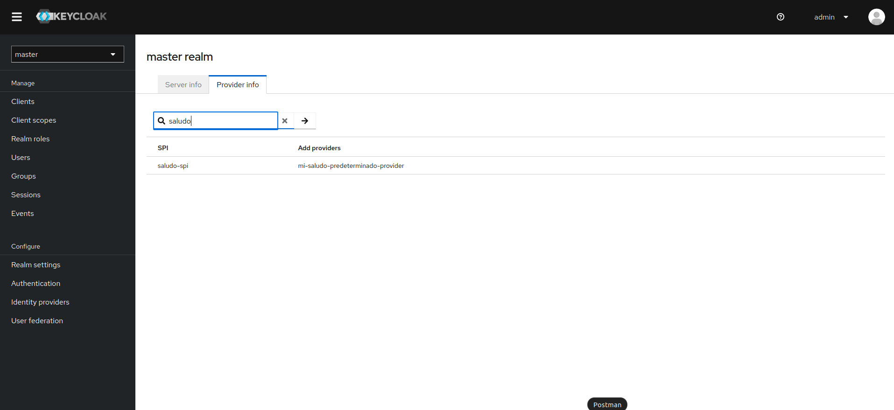

# 8. Proceso de autenticación de un usuario en el servidor Keycloak:
Keycloak, debido a su naturaleza de gestor de identidades para garantizar el correcto proceso de autorización y autenticación de usuarios para aquellas aplicaciones informáticas a las que está adherido, ha desarrollado para su correcto funcionamiento un proceso específico para estos pasos denominado *flujos de autenticación* (en inglés **authentication flows**), los cuales reúnen un conjunto de pasos predefinidos que el usuario entrante deberá resolver satisfactoriamente para poder autenticarse en la plataforma y entrar en nuestra aplicación final. Estos flujos están diseñados para proporcionar una variedad de opciones de autenticación y seguridad, y pueden personalizarse según las necesidades específicas de cada aplicación.

La base teórica de los flujos de autenticación de Keycloak se basa en el estándar de autenticación abierto de OpenID Connect, lo que garantiza la interoperabilidad y la compatibilidad con otras aplicaciones y servicios que siguen este estándar, y define un marco para la autenticación y la autorización en aplicaciones web y móviles. Keycloak extiende este estándar para proporcionar una amplia gama de opciones de autenticación y seguridad, como la autenticación de varios factores (MFA), la autenticación basada en certificados y la autenticación social. Los flujos de autenticación de Keycloak están diseñados para proporcionar una alta seguridad y protección contra ataques de phishing y otras amenazas en línea. Podrás encontrar más información útil sobre todo el proceso de flujos de autenticación dentro de [su guía oficial de administración](https://www.keycloak.org/docs/latest/server_admin/index.html#_authentication-flows).

Para poder trabajar con los flujos de autenticación de nuestro servidor Keycloak, deberemos acceder a la pestaña **'Authentication'** dentro del menú situado en el extremo izquierdo de nuestra consola de administración, y posteriormente acceder a la subpestaña **'Flows'**. Esto nos abrirá la lista de flujos predefinidos que posee el reino del servidor en el que nos encontremos actualmente.

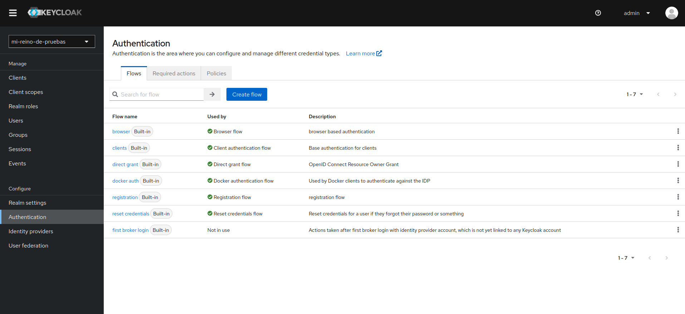

Podremos crear un nuevo flujo desde cero presionando el botón azul llamado **'Create flow'** o emplear un flujo ya creado como plantilla presionando los tres puntos situados en el extremo derecho del flujo a copiar y seleccionando la opción **'Duplicate'**. 

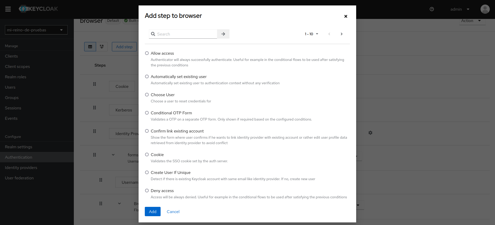

También podremos hacer click en el nombre del flujo que deseemos modificar para acceder a su interior y observar la concatenación de pasos que lo conforman.

Los primeros pasos de los flujos predefinidos siempre son los siguientes:

1. *Cookies*: La primera vez que un usuario inicia sesión en Keycloak, el servidor crea una cookie de sesión. Si la cookie ya había sido creada, este proceso de autenticación es exitoso. Como el proveedor de cookies ha devuelto código exitoso y cada ejecución a este nivel del flujo tiene un requerimiento **Alternative**, Keycloak no gestiona ninguna ejecución y el usuario inicia sesión de forma satistactoria.
2. *Kerberos*: Este autenticador está deshabilitado por defecto y es obviado durante el flujo de autenticación.
3. *Identity Provider Redirector*: Esta acción puede configurarse dentro de *Actions Config*, y sirve para redireccionar a otro proveedor de identidades.
4. *Forms*: Dado que este subflujo está marcado como **Alternative**, éste no se ejecutará si se pasa exitosamente el paso **Cookie**. Contiene un tipo de autenticación adicional que necesita ser ejecutado en el que Keycloak carga las siguientes ejecuciones y las procesa: 
   
   - La primera ejecución es *Username Password Form*, un tipo de autenticación que muestra la página de nombre de usuario y contraseña. Está marcado como obligatorio, por lo que el usuario debe introducir un nombre de usuario y una contraseña válidos. 
   - La segunda ejecución es *Browser - Conditional OTP*, es **condicional** y se ejecuta dependiendo del resultado de la ejecución *Condition - User Configured*, ya que si el resultado es **true**, Keycloak carga las ejecuciones para este subflujo y las procesa.
   - La tercera ejecución es *Condition - User Configured*, donde la autenticación comprueba si Keycloak ha configurado otras ejecuciones en el flujo para el usuario. El subflujo *Browser - Conditional OTP* se ejecuta sólo cuando el usuario tiene una credencial OTP configurada.
   - La última ejecución es *OTP Form*. Keycloak marca esta ejecución como necesaria, pero sólo se ejecuta cuando el usuario tiene una credencial OTP configurada debido a la configuración en el subflujo condicional. En caso contrario, el usuario no ve un formulario OTP.

Una vez en el interior de un flujo de autenticación, podremos introducir un nuevo paso necesario para la autenticación de usuarios según nuestras conveniencias presionando el botón **'Add step'**, donde podremos elegir entre los proveedores de autenticación disponibles en el servidor para insertar donde mejor nos convenga. Como es un flujo, la posición del paso dentro de éste es fundamental, por lo que deberemos asegurarnos que se encuentre debidamente establecida arrastrándolo hacia la posición deseada dentro de éste.

Llegados a este punto, también es importante explicar qué son los *requerimientos* (definidos lógicamente dentro del código Keycloak en la clase enumerada [AuthenticationExecutionModel.Requirement](https://javadoc.io/doc/org.keycloak/keycloak-server-spi/latest/org/keycloak/models/AuthenticationExecutionModel.Requirement.html)), los cuales son unos botones de radio encargados de controlar la ejecución de un determinado paso. Podemos encontrar los siguientes tipos:

- *Required*: Todos los pasos de un flujo que tengan este requerimiento deberán ser ejecutados satisfactoriamente de manera secuencial. El flujo terminará en el momento en el que uno de éstos falle.
- *Alternative*: Únicamente un elemento debe ejecutarse de manera satisfactoria para que el flujo se evalúe como exitoso. Dado que los pasos con requerimiento **Required** son suficientes para marcar un flujo como correcto, cualquier elemento marcado como **Alternative** dentro de un flujo que contenga elementos marcados como **Required** no serán ejecutados.
- *Conditional*: Es un tipo de requisito exclusivo de los subflujos. Un subflujo **Conditional** contiene varias ejecuciones que serán evaluadas como sentencias lógicas de la siguiente manera:

  - Si todas las evaluaciones del subflujo dan como resultado **true**, el subflujo condicional actuará como si tuviera un requerimiento *Required*.
  - Si alguna de las evaluaciones del subflujo da como resultado **false**, el subflujo condicional actuará como si tuviera un requerimiento *Disabled*.
  - Si no se establece ninguna evaluación en el subflujo, éste actuará como si tuviera un requerimiento *Disabled*.
  - Si un flujo contiene ejecuciones y no se establece como *Conditional*, Keycloak no las evaluará y las considerará como *Disabled*.

Una vez que ya dispongamos de nuestro flujo de autenticación correctamente definido según las necesidades de nuestro proyecto, deberemos adicionarlo al cliente encargado de dejar acceder a los usuarios sujetos a dicho proceso de autenticación. Para ello, deberemos acceder a la pestaña *'Clients'* del menú izquierdo de nuestra consola de administración, seleccionar el cliente de nuestro interés, acceder a su interior, viajar hacia la subpestaña *'Advanced'* y posteriormente a la sección *'Authentication flow overrides'*. Ahí encontraremos los menús desplegables donde encontraremos todos los flujos del servidor, disponiendo su uso según convenga a los intereses de nuestro proyecto.

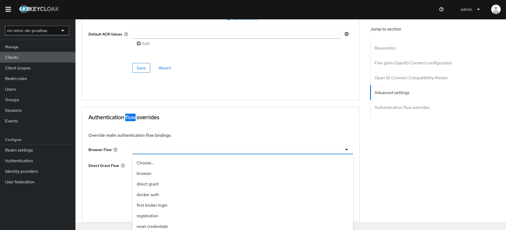

# 9. Personalización de interfaces gráficas para la mejora de UX en Keycloak:
Dentro del amplísimo arsenal de opciones de personalización que el gestor de identidades Keycloak posee en su sistema lógico, en el presente punto trataremos acerca de la manipulación de la interfaz de usuario con la que el sistema se comunica visualmente con el usuario que desea autenticarse en él mediante el uso de *temas* (en inglés **themes**). Los temas son una colección de archivos de plantilla y recursos estáticos, como hojas de estilo CSS y archivos JavaScript, que se utilizan para renderizar las páginas con las que el usuario interacciona gráficamente con Keycloak. Podrás encontrar toda la información relevante para la creación y uso de temas en la [página oficial de desarrollo de servidores](https://www.keycloak.org/docs/latest/server_development/#_themes).

La lógica que sigue Keycloak para implementar los themes se basa en el marco de plantillas de [Thymeleaf](https://www.thymeleaf.org/) y el sistema de herencia de plantillas de [Apache FreeMarker](https://freemarker.apache.org/). Cada tema de Keycloak está compuesto por una serie de archivos de plantilla que definen la estructura y el contenido de las páginas de la aplicación. Los archivos de plantilla se escriben en HTML y Thymeleaf, y se almacenan en el subdirectorio `/themes` existente en el directorio de instalación de Keycloak en el interior de nuestro sistema, hermano del subdirectorio `/providers` para los proveedores que vimos anteriormente.

## 9.1. Temas por defecto:
Keycloak trae por defecto algunos temas, los cuales son los que vemos cuando interactuamos visualmente con él. Estos temas pueden visualizarse entrando en el archivo JAR **org.keycloak.keycloak-themes** situado dentro del subdirectorio `/lib/lib/main` del directorio de instalación de Keycloak. Podremos descomprimirlos y observar la estructura de archivos necesaria para la creación de un tema personalizado, el cual posee las siguientes carpetas:
- */base*: Es el esqueleto del tema base que contiene las plantillas HTML y los paquetes de mensajes para disponer de traducciones en varios idiomas. Todos los temas, incluidos los personalizados, son generalmente heredados de este esqueleto.
- */keycloak*: Contiene las imágenes y las hojas de estilo que se emplearán en los temas. Si no empleamos ningún tema personalizado, éste será el empleado por defecto.
- */keycloak.v2*: Tema basado en React, parte de la nueva consola de Administración. La vieja consola está obsoleta y dejó de tener soporte oficial en la versión Keycloak 21.

No es recomendable modificar los temas ya existentes, sino crear un nuevo tema que extienda alguno de los dos anteriores.

## 9.2. Tipos de temas en Keycloak:
Existen cinco tipos diferentes de temas:
1. *Welcome*: Temas diseñados para la pantalla de inicio en Keycloak.
2. *Login*: Temas diseñados para las pantallas de inicio de sesión, contraseñas de un solo uso, registro, autorización de permisos y olvido de contraseñas en Keycloak.
3. *Account*: Temas diseñados para las pantallas de gestión de cuentas de usuario en Keycloak.
4. *Admin Console*: Temas diseñados para las pantallas de la consola de Administración en Keycloak.
5. *Email*: Temas diseñados para los correos electrónicos que son enviados por el servidor Keycloak.

## 9.3. Estructura interna de los temas:
Al igual que los proveedores, los temas deben tener su propio patrón abstracto para que el servidor Keycloak los reconozca como propios y podamos trabajar con ellos. Para ello, dentro del directorio de nuestro nuevo tema, deberemos poseer una serie de subdirectorios con los nombres de los tipos de temas que deseemos implementar, vistos en el anterior punto de este informe.

Cada tema debe contener en su interior un archivo *theme.properties*. Éste es un archivo de configuración que se utiliza en Keycloak para registrar y configurar los temas de la aplicación. Este archivo contiene una serie de propiedades que definen el nombre del tema, su directorio y otras opciones de configuración, proporcionando una manera de registrar los temas en Keycloak sin tener que modificar el código fuente de la aplicación. Por ejemplo, un caso de *theme.properties* que podemos encontrar en el subdirectorio `/base/account` del archivo JAR descomprimido anteriormente:

    parent=base
    import=common/keycloak
    styles=css/account.css
    stylesCommon=node_modules/patternfly/dist/css/patternfly.min.css node_modules/patternfly/dist/css/patternfly-additions.min.css
    scripts=js/script1.js

En él se puede ver que hacemos que nuestro nuevo tema extienda del tema `base` para que podamos trabajar usando sus códigos HTML y paquetes de mensajes de traducción, además de importar el tema `common` para incluir algunos de sus estilos. También podremos incluir las hojas de estilo CSS que deseemos indicándolo en el apartado *styles* y guardando dichos archivos en el subdirectorio `/resources/css` de nuestro tema. Los *scripts* son adiciones opcionales por si necesitamos incluir archivos JavaScript a medida para nuestras plantillas, guardándolos en el subdirectorio `/resources/js`.

Además de este fichero **properties**, podremos observar desde el JAR descomprimido con los temas predefinidos que existen otros dos directorios dentro de la carpeta del tipo de tema, los cuales son:
- **Messages**: En el interior de este directorio podremos encontrar todo tipo de ficheros **properties** utilizados para las traducciones de las interfaces gráficas en los distintos idiomas a los que se les desee dar soporte.
- **Resources**: En su interior habrá otras carpetas para guardar los archivos de imagen, las hojas de estilo y los scripts de JS.

También podremos encontrar los diferentes ficheros FTL que

## 9.4. Personalizando nuestras interfaces de usuario:
Para crear un nuevo tema personalizado, crearemos dentro del subdirectorio `/themes` del directorio de instalación de Keycloak con el nombre de nuestra elección para este primer tema. En el caso de que deseemos crear un tema con una revisión completa, la mejor manera de empezar será copiando todos los archivos que se encuentran dentro del directorio `/base` que se encuentra dentro del archivo JAR descomprimido que se ha explicado en el anterior párrafo.

Una vez creado el tema en el subdirectorio especificado, podremos reiniciar nuestro servidor Keycloak e insertarlo en el reino que más nos interese. Para ello, deberemos presionar la opción **'Realm Settings'** situado en el menú del extremo izquierdo de la consola de Administración, y una vez en su interior buscar la pestaña **'Themes'**. Aquí podrás poner los temas que desees para el inicio de sesión, la gestión de cuentas, la propia consola de Administración y el envío de correos electrónicos.

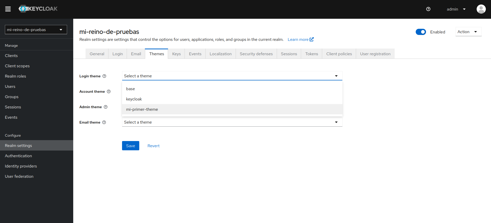

Es importante recordar que *los temas tienen un alcance definido por el reino en el que se encuentren*, por lo que podemos tener diferentes temas para emplear en diferentes reinos. Ten en cuenta este detalle para tener el alcance correcto en tu proyecto.

### 9.4.1. Personalizando el logo de la sección superior de Keycloak:
Si nos fijamos en la parte superior de la consola de Administración, nos daremos cuenta de que allí reza el logo oficial de Keycloak. Mediante el uso de un tema personalizado, podremos cambiar dicho logo por el de nuestra empresa o proyecto. Para ello, sobreescribiremos el directorio **/account** que se encuentra dentro de */keycloak.v2* en el archivo JAR descomprimido anteriormente y lo insertaremos en nuestro recién creado tema. Pondremos nuestro nuevo logo en el interior del subdirectorio **/resources/public** y abriremos el archivo *theme.properties* situado dentro del directorio recién copiado */account*. En su interior veremos el siguiente bloque de código a modificar:

    # This is the logo in upper lefthand corner.
    # It must be a relative path.
    logo=/public/mi-nuevo-logo.png

Es importante destacar que, durante la fase de desarrollo, si deseamos visualizar el efecto de nuestros cambios inmediatamente sin necesidad de reiniciar el servidor; necesitaremos ejecutar Keycloak con el siguiente comando:

`bin/kc.[sh|bat] start --spi-theme-static-max-age=-1 --spi-theme-cache-themes=false --spi-theme-cache-templates=false`

Reiniciamos el servidor para recargar los cambios realizados y accedemos al reino al que hayamos dispuesto el tema de configuración de cuentas. Veremos cómo se habrá actualizado con nuestro nuevo logo:

### 9.4.2. Personalizando la pantalla de inicio de sesión de Keycloak:
Sin duda, una de las pantallas más visitadas tanto por nosotros los desarrolladores/administradores como el resto de usuarios que emplean nuestro servidor de gestión de identidades, es la pantalla de inicio de sesión. Es esa pantalla que nos pide nuestro nombre y credenciales para iniciar el proceso de autenticación en la plataforma. Con nuestro nuevo y flamante tema, podremos actualizar esta pantalla y darle el aspecto que más deseemos para nuestro proyecto. Para ello, lo que deberemos hacer es pegar en nuestro tema personalizado el directorio **/keycloak/login** del fichero JAR descomprimido y fusionarlo con el que ya poseemos en nuestro tema. Veremos que se han añadido las carpetas **/css** y **/img**. En este caso en particular procederemos a cambiar la imagen de fondo de esta pantalla de inicio de sesión, pero si es necesario entrar más en materia podremos modificar a nuestro antojo los ficheros FTL donde se encuentran las plantillas, que en conjunción con las hojas de estilo CSS, nos permitirán diseñar una página de inicio de sesión a medida completamente personalizada.

Seleccionamos la imagen que deseemos emplear como fondo de pantalla y la guardamos dentro del subdirectorio **/resources/img** de nuestro tema de login y, posteriormente, abriremos el archivo *login.css* situado dentro de la carpeta **/resources/css**. Una vez en su interior, accedemos a la sección que especifica la ruta de acceso a la imagen de fondo, la cual se encuentra en la sección análoga a la que hay bajo estas líneas:

    .login-pf body {
    background: url("../img/keycloak-bg.png") no-repeat center center fixed;
    background-size: cover;
    height: 100%;
    }

Deberemos modificar la URL situada en la línea **background** con el nombre de la imagen que deseemos introducir como fondo de pantalla. Debemos recordar cambiar el tema establecido en el menú desplegable *'Login theme'* situado en la pestaña *'Themes'* del menú *'Realm Settings'* situado en el extremo izquierdo de la consola de Administración, y posteriormente acceder a la URL del reino en el que hayamos establecido estos cambios. Podremos apreciar nuestra nueva pantalla de inicio de sesión con la imagen definida en la hoja de estilo:

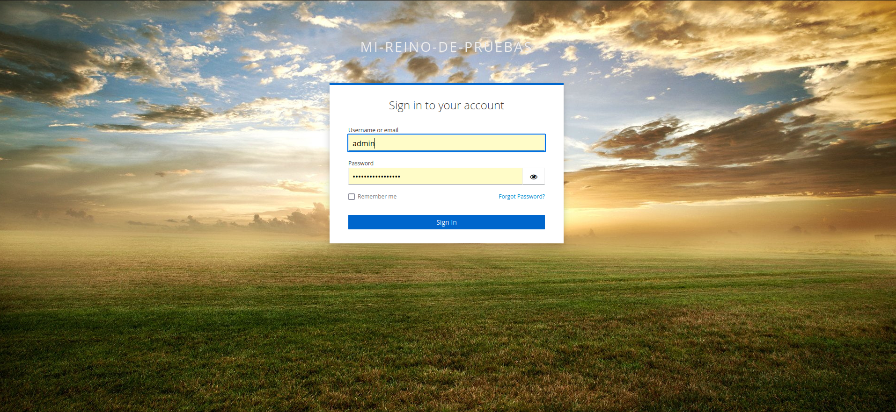

### 9.4.3. Personalizando la pantalla de bienvenida de Keycloak:
Cuando introducimos en nuestro navegador favorito nuestro localhost seguido del puerto de escucha que hayamos dispuesto a Keycloak, observaremos que nos nuestra una pantalla de bienvenida para que nos registremos como alguno de los usuarios que estén registrados en el reino **master**, la cual se verá como se expone bajo estas líneas:

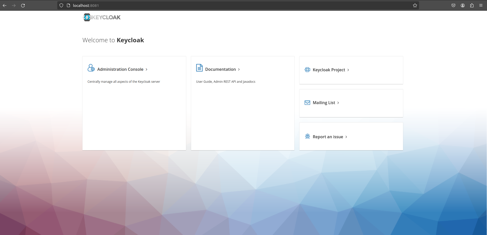

Podremos crear nuestra nueva plantilla para la página de bienvenida creando un nuevo subdirectorio dentro de nuestro tema con el nombre **/welcome**; aunque el mejor consejo es copiar la carpeta situada en el interior de **/theme/keycloak** del archivo JAR descomprimido al inicio del presente punto. Al igual que en el punto anterior, lo que haremos será cambiar la imagen de fondo de pantalla para insertarle la nuestra personalizada. Para ello, y siguiendo el mismo procedimiento que en el punto anterior, entraremos en la hoja de estilo **welcome.css** situada en el interior de la ruta **/welcome/resources/css** y cambiaremos la información del siguiente bloque de código:

    body {
	  background: #fff url(../bg.png) no-repeat center bottom fixed;
	  background-size: cover;
    }

Donde nuevamente cambiaremos la URL de **background** por el nombre de nuestra nueva imagen de fondo.

Como se puede observar en la sección *'Themes'* del apartado *'Realm Settings'* de la consola de Administración, este es el único tipo de tema que no puede ser modificado desde esta sección; por lo que para poder actualizar el aspecto de esta plantilla de bienvenida personalizada será necesario inicializar el servidor Keycloak empleando el siguiente comando:

`bin/kc.[sh|bat] start-dev --spi-theme-welcome-theme=<nombre-theme>`

Donde `<nombre-theme>` es el nombre de la carpeta situada en el subdirectorio **/themes** donde se encuentra nuestro fichero recién copiado **/welcome**. Una vez arrancado el servidor como de costumbre, únicamente tendremos que acceder al localhost con el puerto de escucha de Keycloak para visualizar nuestra nueva pantalla de bienvenida:

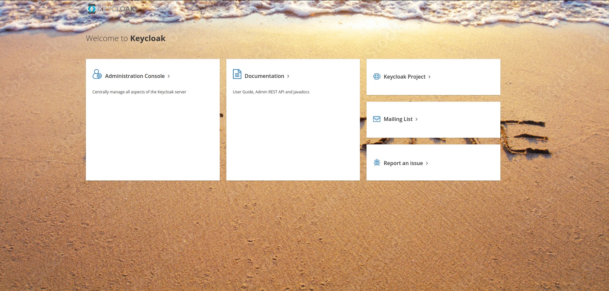
